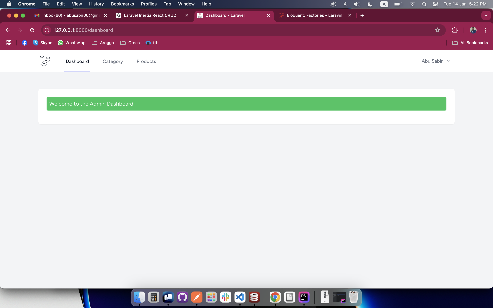
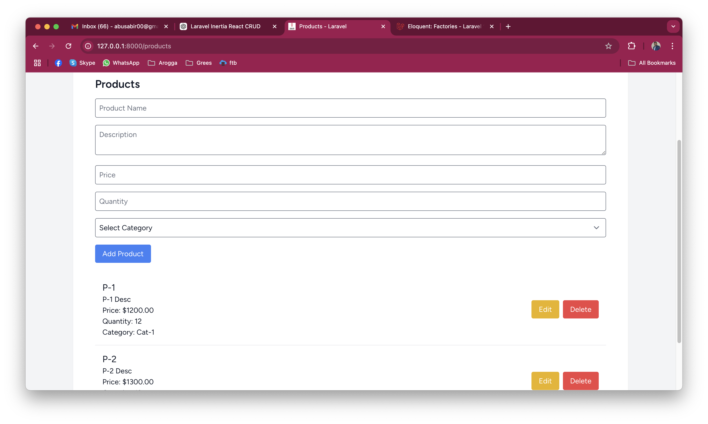
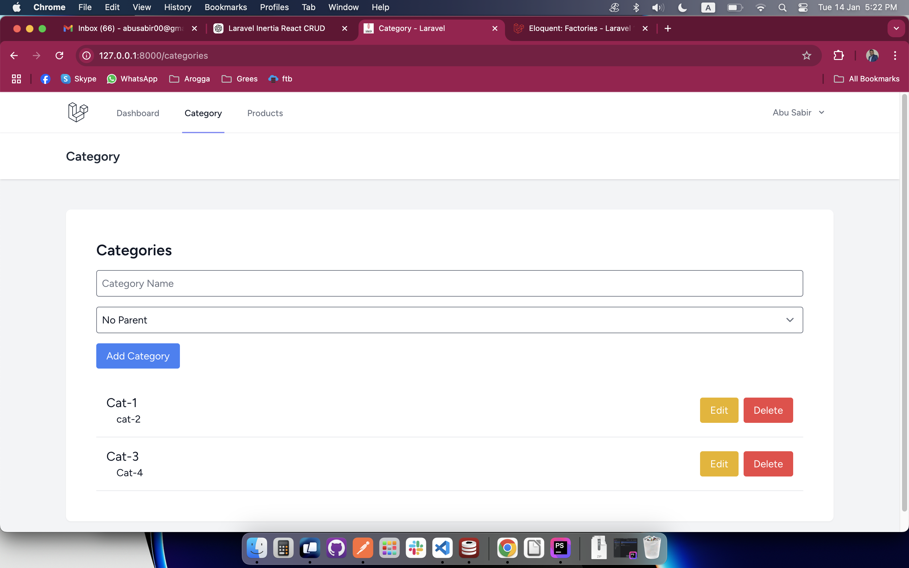
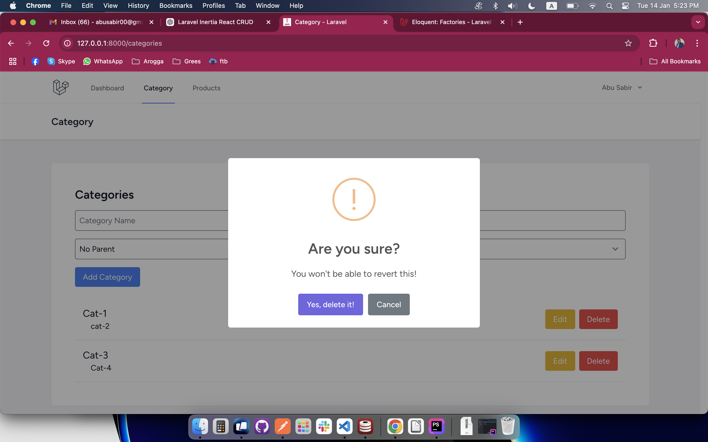
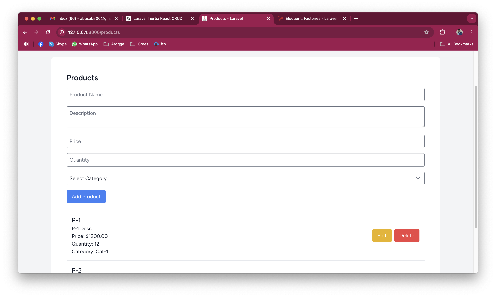
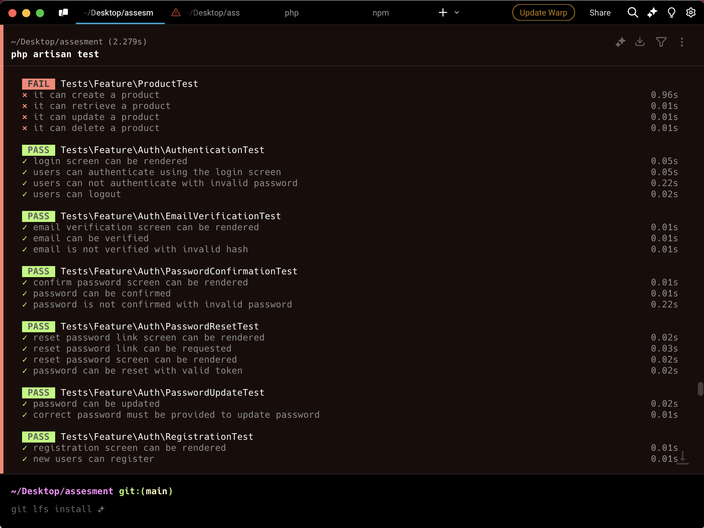

# Laravel Product & Category Management System

This project is a **Laravel 11** application that provides CRUD functionality for managing **categories** and **products**. It supports exporting products to CSV using **Laravel Queues and Jobs**. 

---

## Features

- Manage **categories** with support for nested subcategories.
- Perform CRUD operations for **products**:
  - **Fields**: ID, Name, Description, Price, Quantity, Category ID.
- Export all products into a **CSV file** via an API endpoint.
- Implements **TailwindCSS** for UI.
- Utilizes **SweetAlert** for interactive modals and notifications.

---

## Demo

### Screenshots
1. **Dashboard**  
   

2. **Categories Management**  
   

3. **Products List**  
   

4. **Create Product**  
   

5. ** Product List
   

5. **Test
   

### Video Walkthrough
[Watch the Full Demo](screen/v.mov)

## CSV Export API end-point

http://127.0.0.1:8000/api/export-products
---

## Installation

1. **Clone the Repository**
   ```bash
   git clone https://github.com/your-username/your-repository.git
   cd your-repository


Install Dependencies

bash
Copy code
composer install
npm install
npm run build

Environment Setup

Create an .env file:
bash
Copy code
cp .env.example .env

Queue Setup Ensure the queue worker is running for CSV export:

bash
Copy code
php artisan queue:work

Run the Server

bash
Copy code
php artisan serve
Open your browser and visit:

arduino
Copy code
http://localhost:8000

Run React
npm run dev